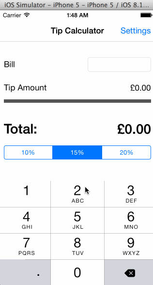

# TipCalculatorCodePath
Tip calculator prerequisite for the CodePath class by Ken Szubzda.

Time spent: 4-5 hours spent in total

Completed user stories:

 * [x] Required: Main tip calculator page
 * [x] Required: Configure default tip percentage on settings page with saving
 * [x] Optional: Configure default currency on settings page with saving
 * [x] Optional: Currency thousands separators
 
 
 

 
 GIF created with [LiceCap](http://www.cockos.com/licecap/).
